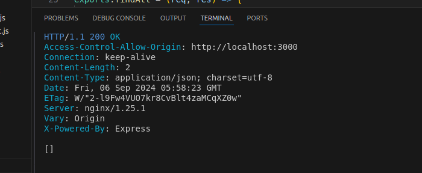

Binju's shared repository: https://github.com/BinjuGit/A2-Binju-21914721.git

#Assignment A
TASK 1 – USER INTERFACE CHANGES

1. Change the button label from contact component from "Delete" to "Delete Contact".

I changed the text in Contact.js, line 40


2. Change the button label in phone component from "Add" to e.g "Add Choiru's Phone".

For this, I changed the code in NewPhone.js, line 36


3. Change the placeholder text "Name" with input type text into a drop-down menu with 4 categories.

I changed the syntax in NewPhone.js, line 34


4. In the <tr> element of the table, change the label "Name" to "Phone Type".

I changed the text in PhoneList.js, line 14


TASK 2 – API COMMAND DEMONSTRATIONS

1. Show the API command for “Show Contact” and provide a screenshot of the output.


2. Show the API command for “Add Contact” and provide a screenshot of the output.


3. Show the API command for “Delete Contact” and provide a screenshot of the output.


4. Show the API command for “Update Contact” and provide a screenshot of the output.


5. Show the API command for “Show Phone” and provide a screenshot of the output.


6. Show the API command for “Add Phone” and provide a screenshot of the output.


7. Show the API command for “Delete Phone” and provide a screenshot of the output.


8. Show the API command for “Update Phone” and provide a screenshot of the output.


TASK 3 – DATABASE MODELING WITH SEQUELIZE AND TEST THE API COMMANDS WHEN THE 
DATABASE MODIFICATION DONE.
1.Modify the contacts

a. Change the syntax as follows in line   of app.js as belows in line 11 and 12.


b. Then adding code in model.js to add the address as follows:


Making changes in controller.js


2, Modify the Phones Table

a. Changing code in phone.model.js in line 8 and 11


b. Editing test phone.controller.js in line 8 and 9 as follows:


3. Adjust the Front-End 

a. Changes made on NewCOntact.js in line 6 and 33


Making chnages in NewPhone.js as below: 


Simply changing the text in Phone.js as follows:


4. Test All APIs related to table modified contacts and phones.

Showing Contacts


Showing contact having 'id' 3


Showing how to add address in contact


Delete contact


Update contact


Showing all phones of a contact id 5


Showing all phones of contact id 5, id 8


Adding phone_type and phone_number


Deleting phone


Updating phone


TASK 4 – EXPANDING THE EXISTING TABLES 

1. Table creation 
Added db.companies = require("./company.model.js")(sequelize, Sequelize); in line 23 of index.js


Then created a new file named 'company.model.js' in api/models. 

module.exports = (sequelize, Sequelize) => {
    const Company = sequelize.define("company", {
        company_id: {
            type: Sequelize.INTEGER,
            primaryKey: true,
            autoIncrement: true
        },
        company_name: {
            type: Sequelize.STRING,
            allowNull: false
        },
        company_address: {
            type: Sequelize.STRING,
            allowNull: false
        },
        contactId: {
            type: Sequelize.INTEGER,
            references: {
                model: 'contacts', // References contacts table
                key: 'id'
            },
            onDelete: 'CASCADE',
            onUpdate: 'CASCADE'
        }
    });

    return Company;
};


Created a new file named'company.controllers.js' in api/controllers.

const db = require("../models");
const Companies = db.companies;
const Op = db.Sequelize.Op;

// Create company
exports.create = (req, res) => {
    const company = {
        company_name: req.body.company_name,
        company_address: req.body.company_address,
        contactId: parseInt(req.params.contactId)
    };

    Companies.create(company)
        .then(data => {
            res.send(data);
        })
        .catch(err => {
            res.status(500).send({
                message: err.message || "Some error occurred while creating the company."
            });
        });
};

// Get all companies
exports.findAll = (req, res) => {
    Companies.findAll({
        where: {
            contactId: parseInt(req.params.contactId)
        }
    })
        .then(data => {
            res.send(data);
        })
        .catch(err => {
            res.status(500).send({
                message: err.message || "Some error occurred while retrieving companies."
            });
        });
};

// Get one company by id
exports.findOne = (req, res) => {
    Companies.findOne({
        where: {
            contactId: req.params.contactId,
            company_id: req.params.companyId
        }
    })
        .then(data => {
            res.send(data);
        })
        .catch(err => {
            res.status(500).send({
                message: err.message || "Some error occurred while retrieving the company."
            });
        });
};

// Update one company by id
exports.update = (req, res) => {
    const company_id = req.params.companyId;

    Companies.update(req.body, {
        where: {
            company_id: company_id,
            contactId: req.params.contactId
        }
    })
        .then(num => {
            if (num == 1) {
                res.send({
                    message: "Company was updated successfully."
                });
            } else {
                res.send({
                    message: `Cannot update Company with id=${company_id}. Maybe Company was not found or req.body is empty!`
                });
            }
        })
        .catch(err => {
            res.status(500).send({
                message: "Error updating Company with id=" + company_id
            });
        });
};

// Delete one company by id
exports.delete = (req, res) => {
    const company_id = req.params.companyId;

    Companies.destroy({
        where: {
            company_id: company_id,
            contactId: req.params.contactId
        }
    })
        .then(num => {
            if (num == 1) {
                res.send({
                    message: "Company was deleted successfully!"
                });
            } else {
                res.send({
                    message: `Cannot delete Company with id=${company_id}. Maybe Company was not found!`
                });
            }
        })
        .catch(err => {
            res.status(500).send({
                message: "Could not delete Company with id=" + company_id
            });
        });
};


I added some codes in contact.controller.js file as follows:


Then I made some changes in the stats.controller.js file in line 4, 11 and 19 which are shown below:

const db = require("../models");
const Phones = db.phones;
const Contacts = db.contacts;
const Companies = db.companies;
const Op = db.Sequelize.Op;

exports.calculate = (req, res) => {
    Promise.all([
        Contacts.count(),
        Phones.count(),
        Companies.count(),
        Contacts.max('updatedAt'),
        Contacts.min('createdAt')
    ])
    .then(([totalContacts, totalPhones, totalCompanies, lastUpdatedContact, oldestContact]) => {
        res.send({
            totalContacts: totalContacts,
            totalPhones: totalPhones,
            totalCompanies: totalCompanies,
            lastUpdatedContact: lastUpdatedContact,
            oldestContact: oldestContact
        });
    })
    .catch(err => {
        res.status(500).send({
            message: err.message || "Some error occurred while performing the calculation."
        });
    });
};


Then opened a file called 'Companies.routes.js' in "/api/routes". 
Syntax used in the file are as follows:

module.exports = app => {
    const companies = require("../controllers/company.controller.js");
    
    // Create a new router instance
    var router = require("express").Router();

    // Create a new company for a specific contact
    router.post("/contacts/:contactId/companies", companies.create);

    // Get all companies for a specific contact
    router.get("/contacts/:contactId/companies", companies.findAll);

    // Get a single company by its ID for a specific contact
    router.get("/contacts/:contactId/companies/:companyId", companies.findOne);

    // Update a company by its ID for a specific contact
    router.put("/contacts/:contactId/companies/:companyId", companies.update);

    // Delete a company by its ID for a specific contact
    router.delete("/contacts/:contactId/companies/:companyId", companies.delete);

    // Use the router for all API routes starting with /api
    app.use('/api', router);
};


Some edits done in app.js file in line 29:


2. API Creation.

SHOW COMPANY



ADD COMPANY


DELETE COMPANY


UPDATE COMPANY


TASK 5 – FRONT END

a. First, creating a new file Company.js in "/frontend/src/components". The code handles both updating and deleting company records by making API requests, and it ensures that the local state (companies) stays in sync with the backend database.

function Company({ contact, company, companies, setCompanies }) {

    // Function to delete a company
    const handleDelete = async () => {
        const response = await fetch(`http://localhost/api/contacts/${contact.id}/companies/${company.company_id}`, {
            method: 'DELETE',
        });

        if (response.ok) {
            const updatedCompanies = companies.filter(comp => comp.company_id !== company.company_id);
            setCompanies(updatedCompanies);
        }
    };

    // Function to update a company
    const handleUpdate = async (event) => {
        event.stopPropagation();

        const updatedCompany = {
            ...company,
            company_name: prompt("Enter new name for the company", company.company_name) || company.company_name,
            company_address: prompt("Enter new address for the company", company.company_address) || company.company_address,
        };

        const response = await fetch(`http://localhost/api/contacts/${contact.id}/companies/${company.company_id}`, {
            method: 'PUT',
            headers: {
                'Content-Type': 'application/json',
            },
            body: JSON.stringify(updatedCompany),
        });

        if (response.ok) {
            const refreshedCompanies = companies.map(comp => (comp.company_id === company.company_id ? updatedCompany : comp));
            setCompanies(refreshedCompanies);
        } else {
            console.error('Failed to update the company details');
        }
    };

    
}

export default Company;


b. Creating a new file NewCompany.js in "/frontend/src/components". This code defines a NewCompany component that manages the creation, updating, and deletion of company records associated with a contact. It uses two pieces of state, companyName and companyAddress, to hold input values for the new company being created. The handleCreate function sends a POST request to add a new company to the database, and once successful, it updates the local list of companies. The handleDelete function sends a DELETE request to remove a company from both the database and the local state. The handleUpdate function uses prompt dialogs to get updated company details and sends a PUT request to update the company information in the database. The component also renders a table of existing companies and displays "Edit" and "Delete" buttons for each company, allowing users to modify or remove company entries as needed.

import { useState } from 'react';

function NewCompany({ contact, companies, setCompanies }) {
    const [companyName, setCompanyName] = useState('');
    const [companyAddress, setCompanyAddress] = useState('');

    const handleCreate = async (event) => {
        event.preventDefault();  // Prevent form submission from refreshing the page

        const response = await fetch(`http://localhost/api/contacts/${contact.id}/companies`, {
            method: 'POST',
            headers: {
                'Content-Type': 'application/json',
            },
            body: JSON.stringify({
                company_name: companyName,
                company_address: companyAddress,
            }),
        });

        const newCompany = await response.json();

        if (newCompany.company_id) {
            setCompanies([...companies, newCompany]);
            setCompanyName('');  // Reset the input fields
            setCompanyAddress('');
        }
    };
    const handleDelete = async (companyId, event) => {
        event.preventDefault();
        event.stopPropagation();
        const response = await fetch(`http://localhost/api/contacts/${contact.id}/companies/${companyId}`, {
            method: 'DELETE',
        });

        if (response.ok) {
            // Remove the deleted company from the companies array in state
            const updatedCompanies = companies.filter((company) => company.company_id !== companyId);
            setCompanies(updatedCompanies);
        }
    };
    const handleUpdate = async (company, event) => {
        event.stopPropagation();

        const updatedCompany = {
            ...company,
            company_name: prompt("Enter new name for the company", company.company_name) || company.company_name,
            company_address: prompt("Enter new address for the company", company.company_address) || company.company_address,
        };

        const response = await fetch(`http://localhost/api/contacts/${contact.id}/companies/${company.company_id}`, {
            method: 'PUT',
            headers: {
                'Content-Type': 'application/json',
            },
            body: JSON.stringify(updatedCompany),
        });

        if (response.ok) {
            const refreshedCompanies = companies.map(comp => 
                comp.company_id === company.company_id ? updatedCompany : comp
            );
            setCompanies(refreshedCompanies);
        } else {
            console.error('Failed to update the company details');
        }
    };

    return (
        <div>
        <form onSubmit={handleCreate} 
        onClick={(e) => e.stopPropagation()}  // Stop event propagation to parent elements
            className='new-company'>
            <label htmlFor='company-name'>Company Name:</label>
            <input
                type='text'
                id='company-name'
                placeholder='Enter the company name'
                onChange={(event) => setCompanyName(event.target.value)}
                value={companyName}
                required
            />
            <label htmlFor='company-address'>Company Address:</label>
            <input
                type='text'
                id='company-address'
                placeholder='Enter the company address'
                
                onChange={(event) => setCompanyAddress(event.target.value)}
                value={companyAddress}
            />
            <button className='button green' type='submit'>
                Create companyName
            </button>
        </form>
          {/* Table to Display Companies */}
          <div className="company-list">
               <table>
                <thead>
                    <tr>
                        <th>Company Name</th>
                        <th>Company Address</th>
                        <th>Actions</th>
                    </tr>
                </thead>
                <tbody>
                    {companies.map((company) => (
                        <tr key={company.company_id}>
                            <td>{company.company_name}</td>
                            <td>{company.company_address}</td>
                            <td>
                                
                            <button
                                    className="button blue"
                                    onClick={(event) => handleUpdate(company, event)}
                                >
                                    Edit
                                </button>
                                <button
                                    type="button"    className="button red" 
                                    onClick={(event) => handleDelete(company.company_id, event)}>
                                    
                                    Delete
                                </button>
                            </td>
                        </tr>
                    ))}
                </tbody>
            </table>
        </div>
        </div>
    );
}

export default NewCompany;


c. Creating a new file CompanyList.js in "/frontend/src/components". This code defines a CompanyList component that renders a list of companies associated with a specific contact. It uses two components: NewCompany, which provides a form to add a new company, and Company, which handles individual company actions like editing and deleting. The component maps through the companies array and renders each company as a Company component. The setCompanies function is passed down to update the list when a company is added, edited, or deleted, ensuring that the UI stays in sync with the current list of companies.

import Company from './Company';
import NewCompany from './NewCompany';

function CompanyList({ contact, companies, setCompanies }) {
    return (
        <div className='company-list'>
            <NewCompany companies={companies} setCompanies={setCompanies} contact={contact} />

            <table>
                
                <tbody>
                    {companies.map((company) => (
                        <Company
                            key={company.company_id}
                            company={company}
                            companies={companies}
                            setCompanies={setCompanies}
                            contact={contact}
                        />
                    ))}
                </tbody>
            </table>
        </div>
    );
}

export default CompanyList;


d.


e. Added code in Contact.js file. The following added function allows users to edit the contact's name and email using a prompt, with the updates being sent to the server and reflected in the local state. The component also has a delete button to remove the contact. Additionally, the contact's associated phone numbers and companies can be expanded or collapsed by clicking on the contact, showing or hiding this information.

// Function to update the contact
     async function doUpdate(e) {
        e.stopPropagation();

        const updatedContact = {
            ...contact,
            name: prompt("Update contact name", contact.name) || contact.name,
            email: prompt("Update contact email", contact.email) || contact.email
        };

        const response = await fetch(`http://localhost/api/contacts/${contact.id}`, {
            method: 'PUT',
            headers: {
                'Content-Type': 'application/json',
            },
            body: JSON.stringify(updatedContact),
        });

        if (response.ok) {
            const newContacts = contacts.map(c => (c.id === contact.id ? updatedContact : c));
            setContacts(newContacts);
        } else {
            console.error('Failed to update the contact');
        }
    }

	 // Modify return section for contact summary, expand/collapse, and edit
     return (
        <div key={contact.id} className='contact' onClick={() => setExpanded(!expanded)}>
            <div className='title'>
                {/* Contact Summary */}
                <h3>{contact.name} - {contact.email}</h3>
                <p>
                    <strong>Phone Count:</strong> {phones.length} | <strong>Company Count:</strong> {companies.length}
                </p>

                {/* Edit and Delete Buttons */}
                <button className='button blue' onClick={doUpdate}>Edit Contact</button>
                <button className='button red' onClick={doDelete}>Delete Contact</button>
            </div>

            {/* Expanded Phones and Companies Information */}
            <div style={expandStyle}>
                <hr />
                <PhoneList phones={phones} setPhones={setPhones} contact={contact} />
                <hr />
                <CompanyList companies={companies} setCompanies={setCompanies} contact={contact} />
            </div>
        </div>
    );
}


g. Changed the text in line 9 from Contacts to 'Add new contact' in ContactList.js. Added some code in line 6 and line 28 of NewContact.js file. 
h. Then in NewContact.js, this added code modifies the return section to include labels for the contact name and address fields, making the form more instructional and interactive. The labeled inputs guide users to enter the necessary contact details, and the "Create Contact" button submits the form, improving user experience and clarity.

   return (
        <form className='new-contact' onSubmit={createContact}>
            {/* Label and Input for Contact Name */}
            <label htmlFor='contact-name'>Contact Name:</label>
            <input
                type='text'
                id='contact-name'
                placeholder='Enter contact name'
                onChange={(e) => setName(e.target.value)}
                value={name}
                required
            />

            {/* Label and Input for Contact Address */}
            <label htmlFor='contact-address'>Contact Address:</label>
            <input
                type='text'
                id='contact-address'
                placeholder='Enter contact address'
                onChange={(e) => setAddress(e.target.value)}
                value={address}
            />

            {/* Submit Button */}
            <button className='button green' type='submit'>
                Create Contact
            </button>
        </form>
    );
    }

h. Added code in App.css. This CSS code styles a table that displays a list of companies in a structured format. It aligns the table in the center, applies consistent padding and borders to the table cells and headers, and uses a light gray background for the header. Additionally, it defines a general .button class for buttons, making them white-texted with rounded corners. It also styles a .blue button class for actions like "Edit," giving it a blue background, which becomes darker when hovered over for better user interaction.

/* Company list styles similar to phone list */
.company-list {
    display: flex;
    flex-direction: column;
    align-items: center;
    width: 100%;
}

.company-list > table {
    margin-top: 10px;
    font-family: Arial, Helvetica, sans-serif;
    border-collapse: collapse;
    width: 100%;
}

.company-list > table td, .company-list > table th {
    border: 1px solid #b1b1b1;
    padding: 8px;
}

.company-list > table th {
    padding-top: 12px;
    padding-bottom: 12px;
    text-align: left;
    background-color: #f2f2f2;  /* Optional: To make the header background stand out */
}
.button {
    border: none;
    color: white;
    padding: 5px 10px;
    text-align: center;
    text-decoration: none;
    display: inline-block;
    font-size: 12px;
    border-radius: 5px;
    cursor: pointer;
}

/* Style for blue button */
.blue {
    background-color: #007BFF; /* Blue color */
}

.blue:hover {
    background-color: #0056b3; /* Darker blue on hover */
}


## Access Database
1 **Plsql Cheat Sheet:**
You can refer to the PostgreSQL cheat sheet [here](https://www.postgresqltutorial.com/postgresql-cheat-sheet/).

2 **Know the Container ID:**
To find out the container ID, execute the following command:
   ```bash
   docker ps
    9958a3a534c9   testsystem-nginx           "/docker-entrypoint.…"   6 minutes ago   Up 6 minutes   0.0.0.0:80->80/tcp   testsystem-nginx-1
    53121618baa4   testsystem-frontend        "docker-entrypoint.s…"   6 minutes ago   Up 6 minutes   3000/tcp             testsystem-frontend-1
    c89e46ac94b0   testsystem-api             "docker-entrypoint.s…"   6 minutes ago   Up 6 minutes   5000/tcp             testsystem-api-1
    9f4aea7cf538   postgres:15.3-alpine3.18   "docker-entrypoint.s…"   6 minutes ago   Up 6 minutes   5432/tcp             testsystem-db-1
   ```
3. Running the application

**docker compose command:**
   ```bash
   docker compose up --build
   ```

4 **Access postgreSQL in the container:**
Once you have the container ID, you can execute the container using the following command:
You will see the example of running the PostgreSQL inside the container.
   ```bash
   docker exec -it testsystem-db-1 psql -U postgres
   choiruzain@MacMarichoy TestSystem % docker exec -it testsystem-db-1 psql -U postgres                                       
   psql (15.3)
   Type "help" for help.
   
   postgres=# \dt
             List of relations
    Schema |   Name   | Type  |  Owner   
   --------+----------+-------+----------
    public | contacts | table | postgres
    public | phones   | table | postgres
   (2 rows)
  
    postgres=# select * from contacts;
    id |  name  |         createdAt         |         updatedAt         
   ----+--------+---------------------------+---------------------------
     1 | Helmut | 2024-08-08 11:57:57.88+00 | 2024-08-08 11:57:57.88+00
    (1 row)
    postgres=# select * from phones;
    id | phone_type |   number    | contactId |         createdAt          |         updatedAt          
   ----+------------+-------------+-----------+----------------------------+----------------------------
     1 | Work       | 081431      |         1 | 2024-08-08 11:59:04.386+00 | 2024-08-08 11:59:04.386+00


postgres=# select * from contacts;
   ```
Replace `container_ID` with the actual ID of the container you want to execute.

## Executing API

### Contact API


1. Add contacts API  (POST)
```bash
http post http://localhost/api/contacts name="Choiru"
        
choiruzain@MacMarichoy-7 TestSystem % http post http://localhost/api/contacts name="Choiru"
HTTP/1.1 200 OK
Access-Control-Allow-Origin: http://localhost:3000
Connection: keep-alive
Content-Length: 102
Content-Type: application/json; charset=utf-8
Date: Thu, 08 Aug 2024 21:01:53 GMT
ETag: W/"66-FmPYAaIkyQoroDwP2JsAZjWTAxs"
Server: nginx/1.25.1
Vary: Origin
X-Powered-By: Express

{
"createdAt": "2024-08-08T21:01:53.017Z",
"id": 1,
"name": "Choiru",
"updatedAt": "2024-08-08T21:01:53.017Z"
}

```
2 Get contacts API  (GET)

```bash
http get http://localhost/api/contacts


choiruzain@MacMarichoy-7 TestSystem % http get http://localhost/api/contacts
HTTP/1.1 200 OK
Access-Control-Allow-Origin: http://localhost:3000
Connection: keep-alive
Content-Length: 104
Content-Type: application/json; charset=utf-8
Date: Thu, 08 Aug 2024 21:04:58 GMT
ETag: W/"68-V+4KuL2xahYt8YAkKG6rKdR7wHg"
Server: nginx/1.25.1
Vary: Origin
X-Powered-By: Express

[
{
"createdAt": "2024-08-08T21:01:53.017Z",
"id": 1,
"name": "Choiru",
"updatedAt": "2024-08-08T21:01:53.017Z"
}
]


```
3. Show/create the API commmand to delete the contacts (DELETE)

```bash


```

4. Show/create the API command to edit the contacts (PUT)
```
http get http://localhost/api/contacts/1/phones

```

### Phone API